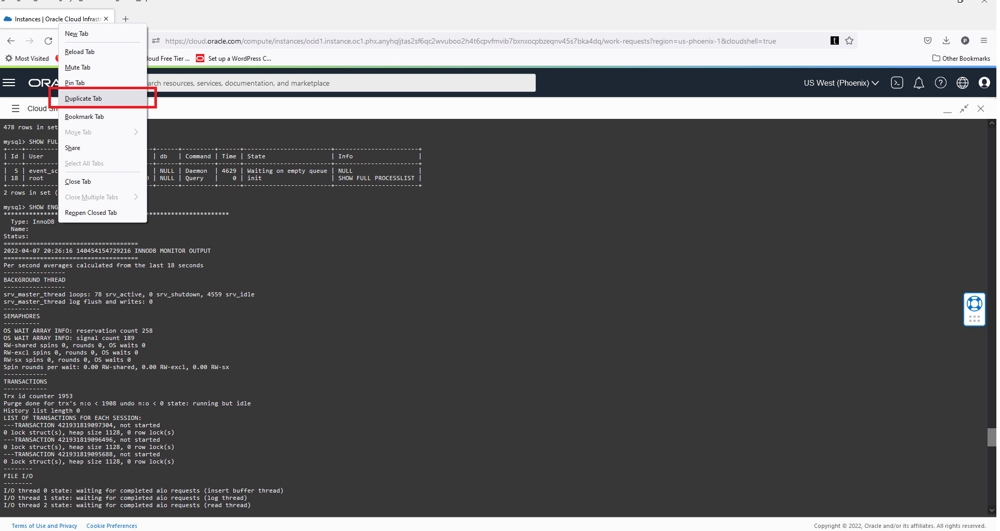
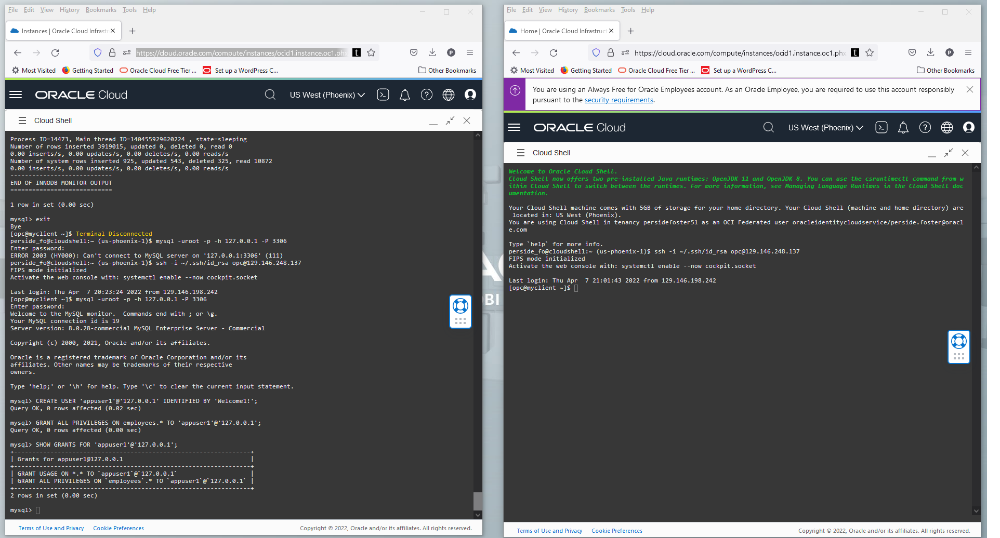

# SECURITY - MYSQL USERS

## Introduction

Users management
Objective: explore user creation and privileges on a Server 


*This lab walks you through creating some users which will be used to Audit.

Estimated Time: 10 minutes


### Objectives

In this lab, you will  do the followings:
- Connect to mysql-enterprise
- Create appuser 

### Prerequisites

This lab assumes you have:
* An Oracle account
* All previous labs successfully completed

* Lab standard  
    -  shell> the command must be executed in the Operating System shell
    -  mysql> the command must be executed in a client like MySQL, MySQL Workbench
    -  mysqlsh> the command must be executed in MySQL shell
    
**Notes:**
- Open a notepad file and  your linux Private IP on student###-serverA 

- serverA  PRIVATE ip: (client_ip)

## Task 1: Connect to mysql-enterprise on Server

1. Connect to your mysql-enterprise with administrative user

   ** shell>** 

    ```
    <copy>mysql -uroot -p -h 127.0.0.1 -P 3306</copy>
    ```

2. Create a new user and restrict the user to your “Server” IP

	a. ** mysql>** 

    ```
    <copy>CREATE USER 'appuser1'@'127.0.0.1' IDENTIFIED BY 'Welcome1!';</copy>
    ```

	b. ** mysql>** 

    ```
    <copy>GRANT ALL PRIVILEGES ON employees.* TO 'appuser1'@'127.0.0.1';</copy>
    ```

	c. ** mysql>** 

    ```
    <copy>SHOW GRANTS FOR 'appuser1'@'127.0.0.1';</copy>
    ```
## Task 2: Connect to a second mysql-enterprise on Server

1. Create a duplicate  Cloud Shell Tab:

    a. Right Click on tab menu

    b. Click the "Duplicate Tab" item
    
    

    c. Wait for the second cloud shell to open and connect

    
    
2. Open a new SSH connection on Server 

    ```
<copy>ssh -i ~/.ssh/id_rsa opc@<your_compute_instance_ip></copy>
    ```

	a. connect to mysql-enterprise with appuser1
    
   ** shell>** 

    ```
    <copy>mysql -u appuser1 -p -h 127.0.0.1 -P 3306</copy>
    ```
	b. Run a select on the tables e.g.

    ** mysql>** 

    ```
    <copy>USE employees;</copy>
    ```

    ** mysql>** 

    ```
    <copy>SELECT * FROM employees;</copy>
    ```

3. Switch to the administrative connection revoke privilege on city to appuser

    ** mysql>** 

    ```
    <copy>REVOKE SELECT ON employees.* FROM 'appuser1'@'127.0.0.1';</copy>
    ```

    ** mysql>** 

    ```
    <copy>SHOW GRANTS FOR 'appuser1'@'127.0.0.1';</copy>
    ```
4. Repeat the select on appuser connection for the user. There is a difference?

    ** mysql>** 

    ```
    <copy>SELECT * FROM employees;</copy>
    ```

## Task 3: Use appuser1 connection
1.	Close and reopen the appuser1 connection for the user, then repeat above commands. There is a difference? 

    ** mysql>** 

    ```
    <copy>exit</copy>
    ```

	** shell>** 

    ```
    <copy>mysql -u appuser1 -p -h 127.0.0.1 -P 3306</copy>
    ```
	** mysql>** 

    ```
    <copy>USE employees;</copy>
    ```
    ** mysql>** 
    ```
    <copy>SELECT * FROM employees;</copy>
    ```
2.	Switch to the administrative connection revoke ‘USAGE’ privilege using and administrative connection and verify (tip: this privilege can’t be revoked…)

	** mysql>**
	```
	<copy>REVOKE USAGE ON *.* FROM 'appuser1'@'127.0.0.1';</copy>
	```
	** mysql>**
	```
	<copy>SHOW GRANTS FOR 'appuser1'@'127.0.0.1';</copy>
	```

3.	Using the administrative connection revoke all privileges using and administrative connection and verify

	** mysql>**
	```
    <copy>REVOKE ALL PRIVILEGES ON *.* FROM 'appuser1'@'127.0.0.1';</copy>
    ```
	** mysql>**
	```
    <copy>SHOW GRANTS FOR 'appuser1'@'127.0.0.1';</copy>
    ```   
4.	Close and reopen appuser session, do you see schemas?

## Task 4: Restore user privileges
1.	Using the administrative connection restore user privileges to reuse it in next labs

	** mysql>**
    ```
    <copy>GRANT ALL PRIVILEGES ON employees.* TO 'appuser1'@'127.0.0.1';</copy>
    ```

## Task 5: Add additional users

1. Using the Administrative Connection, create a new user and restrict the user to your “Server” IP

	a. ** mysql>** 

    ```
    <copy>CREATE USER 'appuser2'@'127.0.0.1' IDENTIFIED BY 'Welcome1!';</copy>
    ```

	b. ** mysql>** 

    ```
    <copy>GRANT ALL PRIVILEGES ON employees.* TO 'appuser2'@'127.0.0.1';</copy>
    ```

2. Using the Administrative Connection, create another new user and restrict the user to your “Server” IP

    a. ** mysql>** 

    ```
    <copy>CREATE USER 'appuser3'@'127.0.0.1' IDENTIFIED BY 'Welcome1!';</copy>
    ```

	b. ** mysql>** 

    ```
    <copy>GRANT ALL PRIVILEGES ON employees.* TO 'appuser3'@'127.0.0.1';</copy>
    ```


## Learn More

* [CREATE USER](https://dev.mysql.com/doc/refman/8.0/en/create-user.html)
* [MySQL Access Control Lists](https://dev.mysql.com/doc/refman/8.0/en/access-control.html)

## Acknowledgements
* **Author** - Dale Dasker, MySQL Solution Engineering

